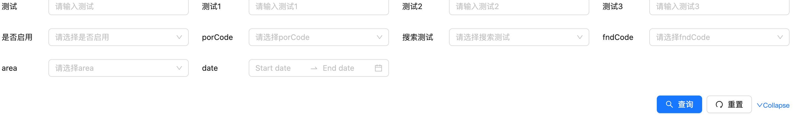

# customer-search-form-table(Rslib project)

<div align="center">


</div>

<div align="left">
</div>

[English](README.md) | [简体中文](README_ZH.md)

- 📦 使用 [rslib](https://github.com/web-infra-dev/rslib) 构建
- 🔄 GitHub Actions 工作流
- 🎯 TypeScript 支持



## 技术栈

1. React: v19.x.x [React](https://reactjs.org/)
2. Antd: v5.x.x [Ant Design](https://ant.design/index-cn)
3. TypeScript: v5.x.x[TypeScript](https://www.typescriptlang.org/)
4. Rsbuild: v1.x.x[Rsbuild](https://rsbuild.rs/)
5. Rslib: v0.x.x[Rslib](https://rslib.rs/)

## 约定式提交

[Conventional Commits](https://www.conventionalcommits.org/zh-hans/v1.0.0/)

## Commit message

1. The commit message should be structured as follows:

   ```bash
     <type>[optional scope]: <description>
     <BLANK LINE>
     [optional body]
     <BLANK LINE>
     [optional footer(s)]
   ```

2. "type-enum": ["build", "chore", "ci", "docs", "feat", "fix", "perf", "refactor", "revert", "style", "test"]

3. type-enum 说明文档：
   - build: 依赖调整
     影响构建系统或外部依赖的更改 (示例作用域：gulp, broccoli, npm）
   - chore: 杂务处理
     其他不会修改源文件或者测试文件的更改
   - ci: 脚本变更
     对 CI 配置文件和脚本的更改（示例作用域： Travis, Circle, BrowserStack, SauceLabs)
   - docs: 文档变更
     添加或者更新文档
   - feat: 添加功能
     引入新的特性
   - fix 错误修复
     修复 bug
   - perf: 性能优化
     更改代码以提高性能
   - refactor: 代码重构
     即不是修复 Bug，也不是添加特性的代码更改
   - revert: 恢复版本
     恢复到上一个版本
   - style: 格式调整
     不会影响代码含义的更改（空格，格式缺少分号等）
   - test: 更新测试
     添加或者更新测试

4. [https://www.npmjs.com/package/devmoji](https://www.npmjs.com/package/devmoji)
5. [https://gitmoji.dev/](https://gitmoji.dev/)
6. [git commit 工具链](https://juejin.cn/post/7067166468797890591)
7. [https://theodorusclarence.com/library/conventional-commit-readme](https://theodorusclarence.com/library/conventional-commit-readme)

## API

Search-form：[API](./src/SearchForm/docs/api.md) | [中文API](./src/SearchForm/docs/api_ZH.md)

Search—table：[API](./src/SearchTable/docs/api.md) | [中文API](./src/SearchTable/docs/api_ZH.md)

## 文档

后续会上.

## 发展

```bash
  1. git clone https://github.com/zhangyi0625/customer-search-form-table.git
  2. cd customer-search-form-table
  3. 可以选择以下两种方式的任一方式启动项目, 其他 cli 参考 package.json 中的 scripts
    - $ npm run dev
    - $ npm run build
```

# 未来计划更新

- 将更多form中的组件加入SearchFormItem
- 现有只支持antd（v5.x.x）,后续将加入Material-UI、Element for React、React Bootstrap、Blueprint UI、Semantic UI React等...

## 参与贡献

> [!NOTE]
> 非常欢迎任何对开源组件的贡献！

## 交流

📖 📖 📖 欢迎大家加我的wx（zy-zy625）交流组件、探讨前端
